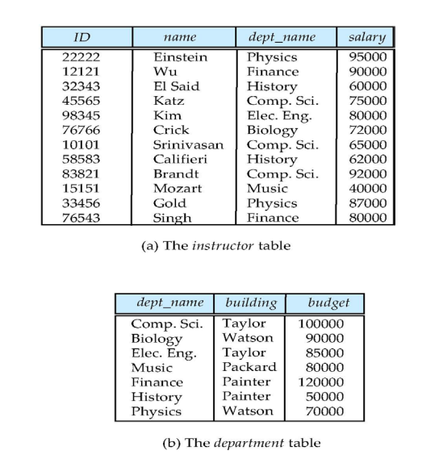
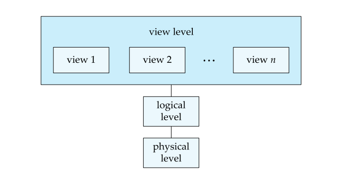
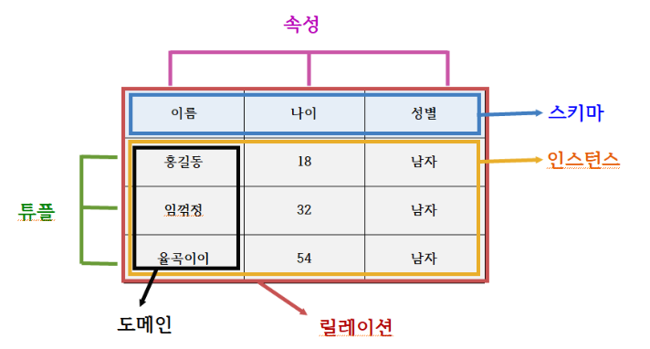
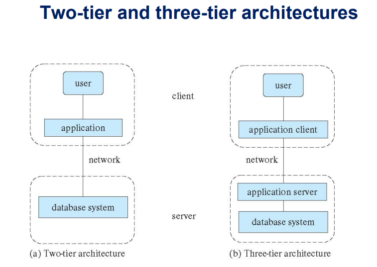

# Ch1 Introduction

## 데이터베이스 시스템의 목적
>  1. Difficulty in accessing data (데이터 접근의 어려움)
>  2. Data isolation (데이터 격리)
>  3. Integrity Problems (무결성 문제)
>  4. Atomicity of Updates (업데이트의 원자성)
>  5. Concurrent access by multiple users (여러 사용자의 동시 엑세스)
>  6. Security Problems (보안 문제)


## View of Data
>  * Data models (데이터 모델)
>       - 데이터, 데이터 관계, 데이터 의미 및 일관성 제약 조건을 설명하기 위한 개념적 도구 모음
>  * Data abstraction (데이터 추상화)
>       - 여러 수준의 데이터 추상화를 통해 사용자로부터 데이터베이스의 데이터를 표현하기 위해 데이터 구조의 복잡성을 숨김

## Data Models

>   * 설명을 위한 도구 모음
>       - Data (데이터)
>       - Data relationships (데이터 관계)
>       - Data semantics (데이터 의미론)
>       - Data constraints (데이터 제약)
>   * 관계형 모델
>   * 엔터티-관계 데이터 모델(주로 데이터 베이스 설계용)
>   * 객체 기반 데이터 모델(객체 지향 및 객체 관계형)
>   * 반구조화된 데이터 모델(XML)
>   * 기타 구형 모델
>       - 네트워크 모델
>       - 계층적 모델

## Relational Model (관계형 모델)
>   * 모든 데이터는 다양한 테이블에 저장됨
>   * 관계형 모델의 표 형식 데이터 예
>
>   

## A Sample Relational Database
>   

## Database system architecture
>   

## Instances and Schemas (인스턴스 및 스키마)
>   * Logical Schema (논리적 스키마)
>       * 데이터베이스의 전반적인 논리적 구조
>   * Physical schema (물리적 스키마)
>       * 데이터베이스의 전반적인 물리적 구조
>   * Instance
>       * 특정 시점의 데이터베이스 실제 내용
>
>   

## Physical Data Independence
>   * 물리적 데이터 독립성
>       * 논리적 스키마를 변경하지 않고 물리적 스키마를 수정하는 기능

## Data Definition Language (DDL)
>   * 표기법
>   ``` 
>   CREATE TABLE instructor (
>       ID          char(5),
>       name        varchar(20),
>       dept_name   varchar(20),
>       salary      numeric(8, 2)
>       )
>   ``` 
>   * Data dictionary contains metadata
>       * 데이터베이스 스키마
>       * 무결성 제약
>           * Primary key (ID uniquely identifies instructors)
>       * 권한부여

## Data Manipulation Language (DML)
>   * 적절한 데이터 모델로 구성된 데이터에 엑세스하고 업데이트 하기 위한 언어
>   * 두 가지 언어 클래스
>       * Pure - 계산 능력에 대한 속성을 증명하고 최적화하는 데 사용된다.
>           * 관계 대수학
>           * 튜플 관계형 계산
>           * 도메인 관계형 계산
>       * Commercial - 상용 시스템 사용
>           * SQL은 가장 널리 사용되는 언어
>   * 데이터 조작 언어 두 가지 유형
>       * Procedural DML (절차적 DML) - 사용자는 필요한 데이터와 해당 데이터를 얻는 방법을 지정
>       * Declarative DML (선언정 DML) - 사용자는 해당 데이터를 얻는 방법을 지정하지 않고 필요한 데이터를 지정
>   * 선언적 DML은 일반적으로 절착적 DML보다 배우고 사용하기 쉬움
>   * 선언적 DML은 비절차적 DML이라고도 한다.

## SQL Query Language
>   * SQL 쿼리 언어는 비절차적, 쿼리는 여러 테이블(혹은 단일)을 입력으로 사용하고 항상 단일 테이블을 반환
>   * 표기법
>   ```
>   SELECT name
>   FROM instructor
>   WHERE dept_name = 'Comp. Sci.'
>   ```
>   * SQL은 Turing machine 과 동등한 언어가 아님
>   * 복잡한 함수를 계산할 수 있도록 SQL은 일반적으로 일부 고급 언어에 내장되어 있음
>   * 응용 프로그램은 일반적으로 다음 중 하나를 통해 데이터베이스에 엑세스한다.
>       * Embedded SQL을 허용하는 언어 확장
>       * SQL 쿼리를 데이터베이스로 보낼 수 있는 응용 프로그램 인터페이스(e.g., ODBC/JDBC)

## Database Design
>   * Logical Design - 데이터베이스 스키마를 결정한다. 데이터베이스 설계에서는 관계 스키마의 좋은 컬렉션을 찾아야 함
>       * 비즈니스 결정 - 데이터베이스에 어떤 속성을 기록해야 하는지
>       * 컴퓨터 과학 결정 - 어떤 관계 스키마를 가져야 하며 다양한 관계 스키마에 속성을 어떻게 배포해야 하는지
>   * Physical Design - 데이터베이스의 물리적 레이아웃 결정

## Database Engine
>   * 데이터베이스 시스템은 전체 시스템의 각 책임을 처리하는 모듈로 분할된다.
>   * 데이터베이스 시스템의 기능적 구성 요소는 다음과 같이 나눌 수 있다.
>       * 스토리지 관리자
>       * 쿼리 프로세서 구성 요소
>       * 트랜잭션 관리 구성 요소

## Storage Manager
>   * 데이터베이스에 저장된 하위 수준 데이터와 시스템에 제출된 응용 프로그램 및 쿼리간의 인터페이스를 제공하는 프로그램 모듈
>   * 스토리지 관리자는 다음 작업을 담당
>       * OS 파일 관리자와의 상호작용
>       * 효율적인 데이터 저장, 검색 및 업데이트
>   * 스토리지 관리자 구성 요소에는 다음이 포함됨
>       * 승인 및 무결성 관리자
>       * 트랜잭션 관리자
>       * 파일 관리자
>       * 버퍼 관리자
>   * 스토리지 관리자는 물리적 시스템 구현의 일부로 여러 데이터 구조를 구현
>       * Data files - 데이터베이스 자체를 저장
>       * Data dictionary - 데이터베이스 구조, 특히 데이터베이스 스키마에 대한 메타데이터를 저장
>       * Indices - 데이터 항목에 대한 빠른 엑세스를 제공할 수 있음. 데이터베이스 인덱스는 특정 값을 보유하는 데이터 항목에 대한 포인터를 제공

## Query Processor
>   * 쿼리 프로세서 구성요소에는 다음이 포함
>       * DDL interpreter - DDL문을 해석하고 데이터 사전에 정의를 기록
>       * DML compiler - 쿼리 언어의 DML문을 쿼리 평가 엔진이 이해하는 하위 수준 지침으로 구성된 평가 계획으로 변환
>           * DML 컴파일러는 쿼리 최적화를 수행. 즉, 다양한 대안 중에서 비용이 가장 낮은 평가 계획을 선택
>       * Query evaluation engine - DML 컴파일러에서 생성된 하위 수준 명령을 실행

## Query Processing
>   1. Parsing and translation
>   2. Optimization
>   3. Evaluation

## Transaction Management
>   * Transaction - 데이터베이스 애플리케이션에서 단일 논리 기능을 수행하는 작업 모음
>   * Transaction-management component - 시스템 오류, 및 트랜잭션 오류에도 불구하고 데이터베이스가 일관된 상태로 유지하도록 보장
>   * Concurrency-control manager - 데이터베이스의 일관성을 보장하는 위해 동시 트랜잭션 간의 상호작용을 제어한다

## Database Architecture
>   * 중앙 집중식 데이터베이스
>       * 1개에서 몇 개의 코어, 공유 메모리
>   * 클라이언트 서버
>       * 하나의 서버 시스템이 여러 클라이언트 시스템을 대신하여 작업을 실행
>   * 병렬 데이터베이스
>       * 많은 코어 공유 메모리
>       * 공유 디스크
>       * 공유한 내용 없음
>   * 분산 데이터베이스
>      * 지리적 분포
>       * 스키마/데이터 이질성

## Database Applications
>   * 데이터베이스 애플리케이션은 일반적으로 2~3개 부분으로 분할
>       * 2계층 아키텍처 - 애플리케이션은 클라이언트 시스템에 상주하며 서버 시스템에서 데이터베이스 시스템 기능을 호출
>       * 3계층 아키텍처 - 클라이언트 시스템은 프런트 엔드 역할을 하며 직접적인 데이터베이스 호출을 포함하지 않음
>           * 클라이언트 측에서는 일반적으로 forms 인터페이스를 통해 애플리케이션 서버와 통신
>           * 애플리케이션 서버는 데이터베이스 시스템과 통신하여 데이터에 엑세스
>
>   

## Database Users
>   * Native users - 이전에 작성된 응용 프로그램 중 하나를 호출하여 시스템과 상호작용하는 복잡하지 않은 사용자
>   * Application programmers - 응용 프로그램을 작성하는 컴퓨터 전문가
>   * Sophisticated users(정교한 사용자) - 프로그램을 작성하지 않고도 시스템과 상호작용
>       * 데이터베이스 쿼리 언어를 사용
>       * 데이터 분석 소프트웨어 같은 도구를 사용
>   * Specialized users - 기존 데이터 처리 프레임워크에 맞지 않는 특수 데이터베이스 응용 프로그램을 작성. 예를들어 CAD, 그래픽데이터, 오디오, 비디오 등

## Database Administrator
>   * 시스템을 중앙에서 통제하는 사람을 데이터베이스 관리자(DBA) 라고 함
>       * 스키마 정의
>       * 저장소 구조 및 엑세스 방법 정의
>       * 스키마 및 물리적 조직 수정
>       * 데이터 접근 권한 부여
>       * 일상적인 유지 보수
>       * 데이터베이스를 주기적으로 백업
>       * 일반 작업에 충분한 여유 디스크 공간 확보. 필요에 따라 디스크 공간 업그레이드
>       * 데이터베이스에서 실행되는 작업 모니터링. 일부 사용자가 제출한 매우 비용이 많이 드는 작업으로 인해 성능이 저하되자 않도록 함
