# Relational Model

## Relational Model (관계형 모델)
>   * 관계형 모델은 오늘날 상용 데이터 처리 애플리케이션을 위한 기본 데이터 모델이다.
>   * 관계형 데이터베이스는 테이블 모음으로 구성되며, 각 테이블에는 고유한 이름이 할당된다.
>   * 테이블의 column(열)은 attribute를 나타낸다.
>   * 테이블의 row(행)는 tubple을 나타낸다.

## Example of a Instructor Relation
>   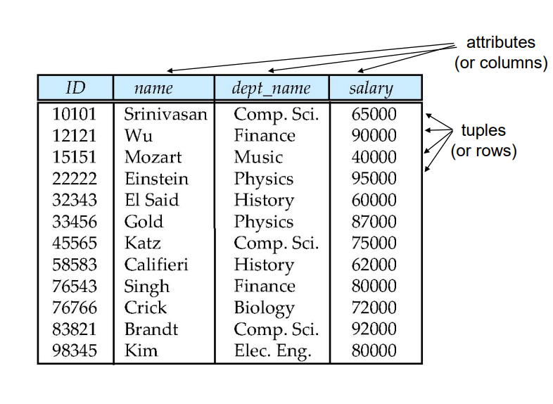

## Attribute
>   * 각 속성에 허용되는 값 세트를 도메인 이라고 한다.
>   * 속성 값은 (일반적으로) 다음과 같아야 한다. atomic; 즉 분리할 수 없는
>   * null은 모든 도메인의 구성요소이다. "알수없음"으로 표시된다.
>   * null 값은 많은 작업의 정의를 복잡하게 만든다.

## Relations are Unordered (관계는 순서가 없다)
>   * 튜플의 순서는 중요하지 않음

## Database Schema
>   * 데이터베이스 스키마 - 데이터베이스의 논리적 구조이다.
>   * 데이터베이스 인스턴스 - 특정 순간에 데이터베이스에 있는 데이터의 스냅샷이다.
>   * 예
>       * schema: instructor(ID, name, dept_name, salary)
>       * Instance
>   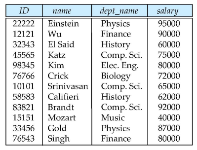

## Keys
>   1. 슈퍼키(Super Key)
>       * 테이블에서 각 행을 유일하게 식별할 수 있는 하나 똔느 그 이상의 속성들의 집합
>       * 유일성이란 하나의 키로 특정 행을 바로 찾아낼 수 있는 고유한 데이터 속성
>       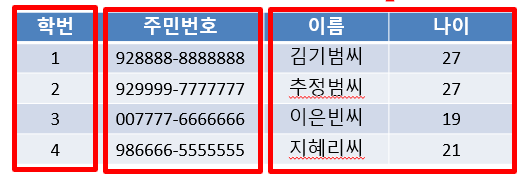
>   2. 후보키
>       * 각 행을 유일하게 식별할 수 있는 최소한의 속성들의 집합
>       * 유일성과 최소성을 동시에 만족해야 한다.
>       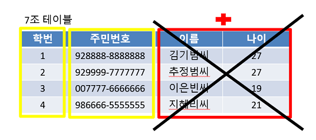
>   3. 기본키
>       * 후보키들 중에서 하나를 선택한 키로 최소성과 유일성을 만족하는 속성
>       * 테이블 안에서 유일하게 각 행들을 구별할 수 있도록 쓰인다.
>       * 기본키는 NULL값을 절대 가질 수 없고, 중복된 값을 가질 수 없다.
>   4. 대체키
>       * 후보키가 두개 이상일 경우 어느 하나를 기본키로 지정하고 남은 후보키들을 대체키라 한다.
>       * 대체키는 기본키로 선정되지 않은 후보키이다.
>   5. 외래키
>       * 다른 테이블의 데이터를 참조할 때 없는 값을 참조할 수 없도록 제약을 주는 것
>       * 참조될 (A)열의 값은 참조될(A) 테이블에서 기본키로 설정되어 있어야한다.
>       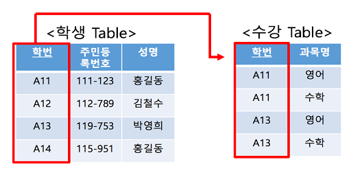

## Relational Query Languages
>   * 절차적, 비절차적 또는 선언적
>   * "Pure languages"
>       * Relational algebra (관계대수학)
>       * Tuple relational calculus (튜플 관계형 계산)
>       * Domain relational calculus (도메인 관계형 계산)
>   * 위의 3개 Pure languages는 컴퓨터 성능 면에서 동일하다.
>   * 이번 장에서는 Relational algebra에 집중
>       * turning-machine과 동등하지 않음
>       * 6가지 기본 동작으로 구성

## Relational Algebra
>   * 하나 또는 두 개의 관계를 입력으로 취하고 그 결과를 새로운 관계를 생성하는 일련의 작업으로 구성된 절차적 언어
>   * 6가지 기본 연산자
>       * select: σ
>       * project: ∏
>       * union: ∪
>       * set difference: –
>       * Cartesian product: x
>       * rename: ρ

## Select Operation
>   * Select 연산은 주어진 조건을 만족하는 튜플을 선택한다
>   * 표기법 
>
>       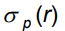
>   * p는 selection predicate 라고 불린다.
>   * 예
>       * Query 
>
>       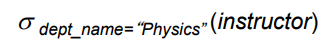
>       * Result
>
>       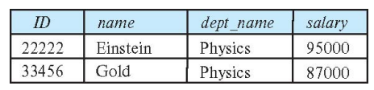
>   * 비교 - =, ≠, >, ≥. <. ≤
>   * 접속사를 사용하여 여러 술어로 결합할 수 있다 - ∧ (and), ∨ (or), ¬ (not)
>   * 연봉이 $90,000 이상인 물리학 강사를 찾으면 다음과 같이 쓴다.
>       
>       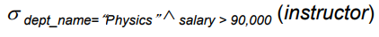
>   * 선택 술어에는 두 속성 간의 비교가 포함될 수 있다
>       * 예를들어 이름이 건물 이름과 동일한 모든 부서를 찾는다.
>       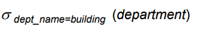

## Project Operation
>   * 특정 속성을 제외한 인수 관계를 반환하는 다항 연산이다.
>   * 표기법
>
>       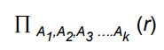
>   * Query
>       
>       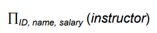
>   * Result
>   
>       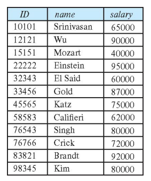
>   * 물리학과의 모든 강사 이름을 찾으십시오.
>   
>       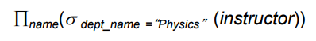

## Catesian-Product Operation (데카르트 곱 연산)
>   * 데카르트 곱 연산(X로 표시)을 사용하면 두 관계의 정보를 결합할 수 있다.
>   * 예
>   
>       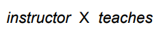

## Join Operation
>   * 데카르트 곱
>   * 강사 및 강사가 가르친 과정과 관련된 내용을 다음과 같이 작성한다.
>   
>       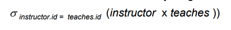
>
>       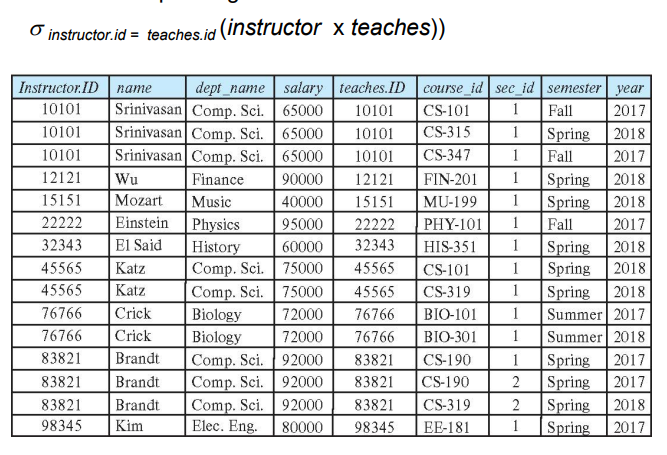
>
>       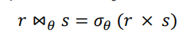
>       
>       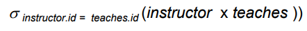
>
>       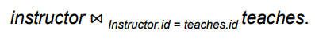

## Union Operation
>   * Union 연산을 이용하면 두 관걔를 결합할 수 있다.
>   * 표기법
>
>       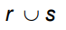
>   * r, s 동일한 수의 속성을 가지고 있어야 한다.
>   * 예: 2017년 가을학기, 2018년 봄학기, 또는 두 학기 모두에 진행된 모든 강좌를 찾으려면
>
>       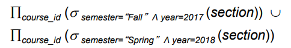
>   * Result
>
>       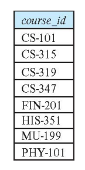

## Set-Intersection Operation
>   * 2017년 가을 학기와 2018년 봄 학기에 강의된 모든 강좌 세트를 찾는다.
>   
>       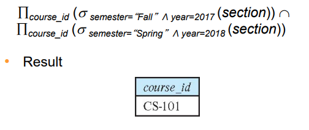

## Set Difference Operation
>   * 예: 2017년 가을학기에는 강의한 과목을 모두 찾고, 2018년 봄학기에는 강의하지 않은 과목을 찾으려면
>
>       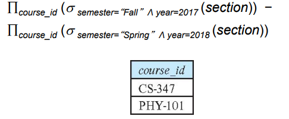

## The Assignment Operation
>   * 임시 관계 변수에 일부를 할당하여 관계 대수 표현식을 작성하는 것이 때때로 편리하다.
>   * ← 로 할당한다.
>   * 예:
>   
>       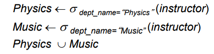

## The Rename Operation
>   * 표현식
>   
>       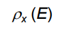
>
>       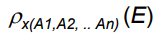

## Equivalent Queries
>   * 예: 물리학과 강사가 연봉 90,000 이상인 강의에 대한 정보 찾기
>       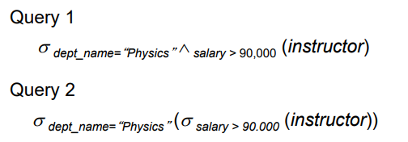
>
>   * 예: 물리학과 강사가 가르치는 강좌에 대한 정보 찾기
>       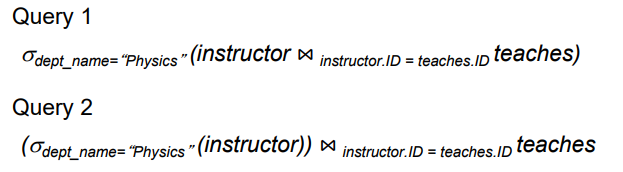

